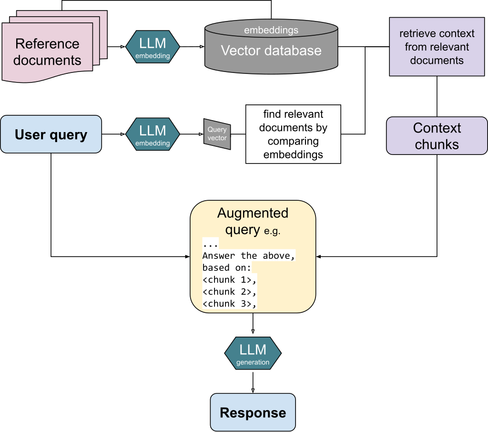

# Ragger
## Description
[RAG](https://en.wikipedia.org/wiki/Retrieval-augmented_generation) stands for Retrieval-Augmented Generation. It helps large language model (LLM) to answer questions with reference to specific documents.
In this RAG system, it contains following parts
- Chunking: Divide documents to small parts
- Embedding: Give each chunk a vector to represent the content
- Retrieving: Given a question, embed the question, find the chunk with the closest vector distance
- Augmenting: Send the question and the closest chunk to LLM
- Generation: LLM generate the answer based on the context

## Components
Llama-index is used to build the RAG system and orchestrate everything. Jina-index is used for embedding document in german. GPT3-turbo (fee required) and Llama3 (free) are used for LLM. Frontend is built by html/css/javascript. Backend is built by Flask.
## Features
A JavaScript library pdf-worker is used to show the document with marked chunk side by side for the user to proof the authenticity of the answer.
## Installation
(Before the app is deployed)

`pip install -r requirements.txt`

Install some packages manually
`pip install llama-index-embeddings-jinaai, llama-index-llms-ollama`

Start the programm
`python app.py`

Open a browser and type in: http://127.0.0.1:5000/